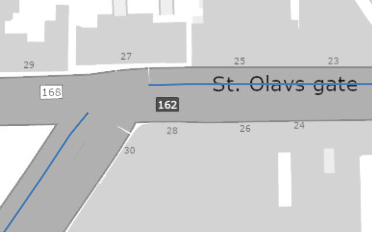

# Mapping routing data to NVDB road network
 
## The problem: 

Data for routing applications are interested in the topology level _"Kjørebane" (KB) - where the cars drive"_, 
whereas most 
data in NVDB exists on the topology level _"Vegtrasé (VT) - where you'll find NVDB data"_. Typically, you have two  _"Kjørebane"_ to describe the physical reality of two oposing trafic flows. Right between those is the imaginary _"Vegtrasé"_. Please consult these resoruces for a more thorough explanation: 

  * [Topology level explained](https://nvdbtransportportal.vegdata.no/konsept5_network.html#topology-levels)
  * [Another example](https://github.com/LtGlahn/nvdbspeedlimit/blob/main/grabbing-from-NVDBapi.md)
  * [Håndbok v830 Nasjonalt vegreferansesystem](https://www.vegvesen.no/globalassets/fag/handboker/hb-v830-nasjonalt-vegreferansesystem.pdf) This is the most complete reference (in Norwegian only)

A simple, two lane road is NOT modelled with separate _"Kjørebane"_ (KB) topology. Sometimes called _"Vegtrasékjørebane"_ (VTKB), a single link sequence at the uppermost _"Vegtrasé"_ topology level works just fine for most regular roads. The additional topology level _"Kjørebane"_ is used for more complex road networks. 

Perhaps it is best to think of these as valid, but alternative ways of modelling any particular road. In NVDB, we can choose between these two models
  * The simples model needs only one link sequence to model the road and traffic flow, at the VT topology level. 
  * The more sophisticated model needs three link sequences in a hierarchy: One at the VT topology level, and then one for each traffic flow at the underlying KB level. The KB links will have a relationship to the overlying VT link.  

Both these models are used extensively in NVDB. This has caused considerable pain and confusion for consumers of NVDB data, in particular when you have to switch between these two representations as you traverse the road network. 

## Solution

1. Download NVDB road data. All road links at the _"Kjørebane"_ topology level will have a reference to the associated _"Vegtrasé"_ through the `superstedfesting` element, identifying which part of the _"Vegtrasé"_ link sequence that corresponds to each  _"Kjørebane"_ link.   
1. Using NVDB network data to identify which links in the _ruteplan_ data that is on the _"Vegtrasé"_ topology level, and which that are on the _"Kjørebane"_ level.
1. Construct a mapping from _"Kjørebane"_ to _"Vegtrasé"_ topology level for _ruteplan_ data by combining the NVDB road data with the _ruteplan_ data, interpolating the linear position floating 

# Terminology 

**Link sequence** (Norwegian: Veglenkesekvens) is _a bag of links_, i.e. one link secuence is the data container for at least one and possibilly many links. The individual links may die, but the abstract data container _link sequence_ is indifferent to time (it has a start date, but no termination date - ever). 

**Link** (Norwegian: Veglenke) The individual road links. The time evolution of the road network is managed by manipulating the start- and end date (norwegian: `startdato, sluttdato`) of the individual links, splitting links into shorter pieces, adding new ones and terminating old ones with `sluttdato` as needed. The physical road network at any given times is represented by those links that are active (i.e. not past its expiration date `sluttdato`). 

In NVDB api LES, you'll find this model in the composition of the REST api URL `/vegnett/veglenkesekvenser/<veglenkesekvensid>` [documentation](https://nvdbapiles-v3.atlas.vegvesen.no/dokumentasjon/openapi/#/Vegnett/get_vegnett_veglenkesekvenser__veglenkesekvensid_), or possibly you prefer the more detailed [segmented representation](https://nvdbapiles-v3.atlas.vegvesen.no/dokumentasjon/openapi/#/Vegnett/get_vegnett_veglenkesekvenser_segmentert__veglenkesekvensid_). 

**Linear referencing** The back bone of NVDB is linear referencing, i.e. the position along a particular link sequence. Those positons are non-dimensional, i.e. a floating point number in the range `[0, 1]`. 
  * A point is described as a single floating point value at the particular link sequence ID, example `0.5@625977`. 
  * A section of the road is described as a range of floating point numbers at that particular link sequence ID, or more likely a list
  of such ranges. Example `0-0.37@625977` or a list: `0.37648714-0.72087082@605474,0.68519209-1@625521,0.71230154-1.0@625522`
  * These floating point values are valid with 8 decimal presion (i.e. 8 digits after decimal separator, 0 = 0.00000000). 

The linear referencing system can be used to query NVDB for data, se [documentation](https://nvdbapiles-v3.atlas.vegvesen.no/dokumentasjon/openapi/#/Vegobjekter/get_vegobjekter__vegobjekttypeid_). Please observe that the linear referencing system is oblivious to how many links there may be along any particular link sequence, and the time evolution of those links. 

# Example 

We start with a 2.7km long route in from our routing application, from Storgata 51, Oslo (262819.18, 6649657.89 in EPSG:5973) to Munkedamsveien 59 (260805.98, 6649240.36), using this http request: https://www.vegvesen.no/ws/no/vegvesen/ruteplan/routingservice_v2_0/routingservice?format=json&geometryformat=isoz&returnNvdbReferences=True&stops=262819.18,6649657.89;260805.98,6649240.36 , saving the result into the file `ruteplanrespons.json`. 


Here's a particular link sequence at the  uppermost topology level "Vegtrasé", which partly overlaps our rote. The ink sequence  625517 is part of Rv162, running from east to west, starting approximately north of Oslo Central station 
and forming a nice curve ending northeast of Stortinget. This is part of the "Ring 1" road system encirkling Oslo city center. 


And here's the "kjørebane" topology link sequence 625977 that extends along parts of 625517.


Note that the link sequence 625977 is not continuous: There is a 25m gap at the junction St Olavs gate - Munkedamsveien. This part of 625977 has been replaced with other link sequences, and linear position  0.693934 - 0.715763 @ 625977 ceased to be valid at "sluttdato" 2014-01-01. 



Here's a detailed view of both 625977 (blue, at the KB level) and 625517 (red, at the VT level). Note how the KB 625977 (blue) is a reasonable good representation of cars would actually drive, whereas the VT 625517 (red) more closely follows the center line / center barriers. 


Same view with aerial image: 


The view from the drivers seats, traveling west at St. Olavs gate approaching junction Munkedamsveien. The VT 625517 link follows the yellow center line, whereas the KB 625977 is approximately at the white dividing lane between the two lanes. Camera position and direction 
indicated by white arrow at miniature map below. 


This is what Munkedamsveien looks like just after completing the left turn from St. Olavs gate. VT 625517 is in the middle of the lane separation barrier in left part of the picture, and KB 625977 right between the two lanes towards southwest. 


# Detailed analysis of KB 625977 mapping to VT 625517

Tabulating the individual links for the _"Kjørebane"_ link sequence [/vegnett/veglenkesekvenser/625977](https://nvdbapiles-v3.atlas.vegvesen.no/vegnett/veglenkesekvenser/625977) and its relain (superstedfesting) to _"Vegtrasé"_ link sequence 625517, we in particular note: 

  * The link sequence 625977 has 21 links
  * Two of those links have an expiration date (`sluttdato`) of 2014-01-01, which corresponds to the "gap" at St. Olavs gate in the above map. 
  * Like all other link sequences, the non-dimmensional linear position starts at 0 (`startposisjon`, first row) and ends at 1 (`sluttposisjon`).  
  * This _"Kjørebane"_ link is related to **a part of** _"Vegtrasé"_ link sequence 625517 (`super_veglenkesekvensid`), starting at position 0.338228 (`super_startposisjon`) and ending at 971812 (`super_sluttposisjon`). 
    * So to transfer from _Kjørebane_ to _Vegtrasé_, some calculation is involved to get the correct linear position.

| veglenkesekvensid | startposisjon | sluttposisjon | super_veglenkesekvensid | super_startposisjon | super_sluttposisjon | sluttdato | 
|--------|--------- |------------|---------|-----------|----------|---------|
| 625977 | **0** | _0.00837852_   | 625517  | **0.338228**  | 0.343063 | |
| 625977 | _0.00837852_ | 0.024945   | 625517  | 0.343063  | 0.353239 | |
| 625977 | 0.024945 | 0.043991   | 625517  | 0.353239  | 0.365024 | |
| 625977 | 0.043991 | 0.047856   | 625517  | 0.365024  | 0.367415 | | 
| 625977 | 0.047856 | 0.086954   | 625517  | 0.367415  | 0.392232 | |
| 625977 | 0.086954 | 0.323563   | 625517  | 0.392232  | 0.542417 | |
| 625977 | 0.323563 | 0.326340   | 625517  | 0.542417  | 0.544170 | |
| 625977 | 0.326340 | 0.376621   | 625517  | 0.544170  | 0.575918 | |
| 625977 | 0.376621 | 0.379417   | 625517  | 0.575918  | 0.577682 | |
| 625977 | 0.379417 | 0.437617   | 625517  | 0.577682  | 0.614389 | |
| 625977 | 0.437617 | 0.451707   | 625517  | 0.614389  | 0.623128 | |
| 625977 | 0.451707 | 0.456277   | 625517  | 0.623128  | 0.626042 | |
| 625977 | 0.456277 | 0.597619   | 625517  | 0.626042  | 0.716154 | |
| 625977 | 0.597619 | 0.693934   | 625517  | 0.716154  | 0.777851 | |
| ~~625977~~ | ~~0.693934~~ | ~~0.706052~~   | 625517  | 0.776696  | 0.784314 | **2014-01-01** |
| ~~625977~~ | ~~0.706052~~ | ~~0.715763~~   | 625517  | 0.784314  | 0.790520 | **2014-01-01** |
| 625977 | 0.715763 | 0.764746   | 625517  | 0.788850  | 0.821825 | |
| 625977 | 0.764746 | 0.861270   | 625517  | 0.821825  | 0.882374 | |
| 625977 | 0.861270 | 0.872393   | 625517  | 0.882374  | 0.889889 | |
| 625977 | 0.872393 | 0.995419   | 625517  | 0.889889  | 0.966778 | |
| 625977 | 0.995419 | **1**      | 625517  | 0.966778  | **0.971812** | |


# Mapping from _Kjørebane_ to _Vegtrasé_ example

Now our ruteplan - example has this element which references 625977 and must be mapped 
to superstedfesting 625517

```json
{
"direction": 1,
 "fromrellen": 0.00837852,
 "reflinkoid": 625977,
 "torellen": 0.69393384
 }
```

We first grab the starting position `fromrellen=0.00837852`, which is ruteplan-terminology for `startposisjon`.

> Please don't be distracted that we only display the first 6 digits in the above table. In NVDB, 
> we use 8 digit precision when dealing with linear positions. All those 8 are preserved in our data processing, regardless 
> of how numbers are displayed in the above table.

First we check to see if we have an exact match for these positions in our table. We need to check both the `startposisjon` and the `sluttposisjon` columns. In our case, the `fromrellen=0.00837852` value exactly matches the `sluttposisjon` value of the first row, meaning that the position from ruteplan starts exactly at the end point of our first row. Therefore it is no suprise that the value `0.00837852`  also an exact match for the `startposisjon` of the second row. 

If we hadn't found an exact match we would have to find the row with `startposisjon < fromrellen < sluttposisjon`, and then interpolate 
into the corresponding `[super_startposisjon, super_sluttposisjon]` range. 

We repeat this process for the `sluttposisjon`, i.e. the `torellen` floating point value.

We now hav enough information to update our data with the appropriate values for `super_veglenkesekvens` (reflinkoid), `super_startposisjon` (fromrellen) and `super_sluttposisjon` (torellen). For reference and debugging, we tuck away the _"Kjørebane"_ values into the tag `kjbane`: 

```json 
{
    "reflinkoid": 625517,
    "fromrellen": 0.34306253,
    "torellen": 0.77669617,
    "kjbane": {
        "direction": 1,
        "fromrellen": 0.00837852,
        "reflinkoid": 625977,
        "torellen": 0.69393384
    }
}
```

# Fetching NVDB data along the route

After mapping all NVDB links to the appropriate "superstedfesting", we are ready to query NVDB api LES for data. The syntax for querying data for veglenkesekvens is  `<startposisjon>-<sluttposisjon>@veglenkesekvens`, which is a text string where `startposisjon` and `sluttposisjon` are specified with 8 decimals precision. (You may use fewer decimals - but your data value is always evaluated down to 8 decimals, so 0.1 = 0.10000000). 

Translating the "ruteplan" lingo into NVDB speak, we have  
  * startposisjon = fromrellen _(from-position, relative length (i.e. linear position))_ 
  * sluttposisjon = torellen _(to-position, relative length (i.e. linear position))_
  * veglenkesekvens = reflinkoid 

So the above ruteplan reflinkoid-example translates to the text string `0.34306253-0.77669617@625517`. The complete text string for our 2.7km long route is 

```
0.37648714-0.72087082@605474,0.68519209-1@625521,0.71230154-1.0@625522,0-0.94874978@625524,
0.94874978-1.0@625524,0.34306253-0.77669617@625517,0.7778511-0.78431368@625517,
0.78431368-0.78885039@625517,0.78885039-0.97181215@625517,0.97181215-1@625517,
0-0.352951@625529,0-0.19111468@625518,0.19111468-0.20169338@625518,
0.21271608-0.21690259@625518,0.21690259-0.89546435@625518,0.89546435-0.958216@625518
```

And the complete URL for fetching speed limits (object type 105 Fartsgrense) from NVDB api LES is https://nvdbapiles-v3.atlas.vegvesen.no/vegobjekter/105?veglenkesekvens='0.37648714-0.72087082@605474,0.68519209-1@625521,0.71230154-1.0@625522,0-0.94874978@625524,0.94874978-1.0@625524,0.34306253-0.77669617@625517,0.7778511-0.78431368@625517,0.78431368-0.78885039@625517,0.78885039-0.97181215@625517,0.97181215-1@625517,0-0.352951@625529,0-0.19111468@625518,0.19111468-0.20169338@625518,0.21271608-0.21690259@625518,0.21690259-0.89546435@625518,0.89546435-0.958216@625518'&inkluder=alle

Our speed limit data (thick yellow) will have somewhat larger extent than our ruoting data (thin red), here's a detailed view of our start point. Speed limit data extend all the way to the junction Hausmanns gate, 
whereas our route starts 15 meters away from that junction. 


Here's an example of how switching between the two different methods of modelling road network, _single VT only-model_ versus _VT + KB combination model_, creates weird kinks and artefacts. 


Here's another example that your query to NVDB api LES will return the extent of the NVDB objects that matches your query - and **NOT matched exactly** to your detailed positional query. 


However, the parameter `segmentering=true` (which is the default) will exclude some results that are at totally different link sequences. Here's what it looks like if you set `segmentering=false`: 


And here with `segmentering=true` (the default)

